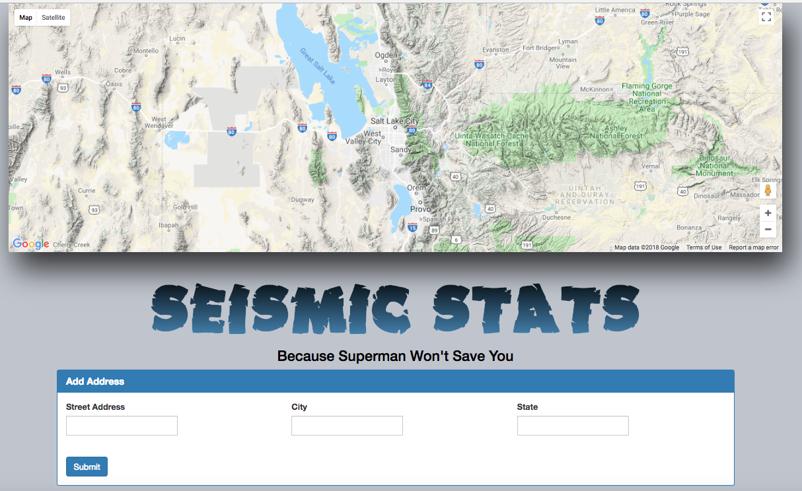
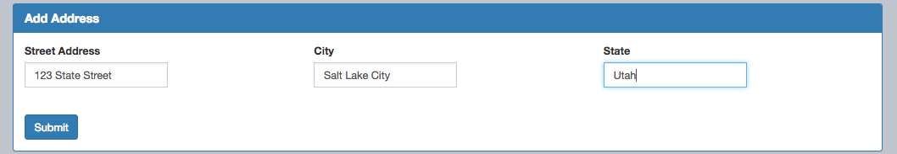
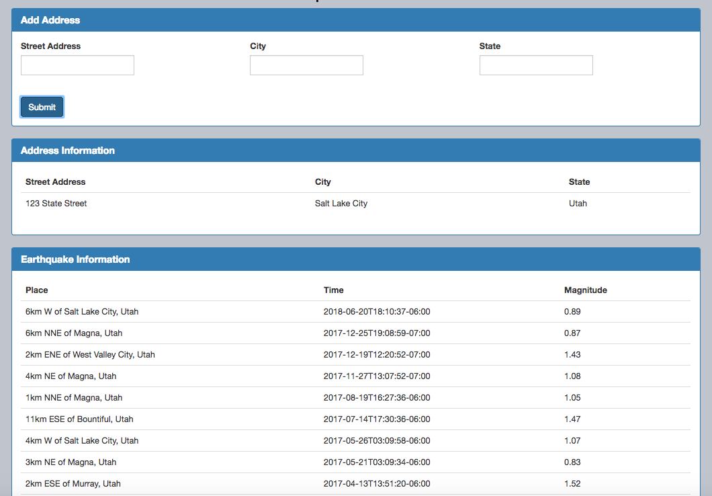
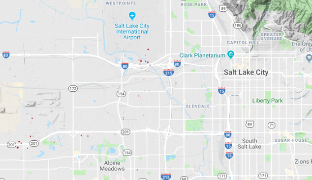

# Seismic_Stats

This website allows users to search the earthquake history of a specific address or city/state.

It translates the address into the latitude and longitude parameters required to access earthquake data gathered by the U. S. Geological Survey from seismographic stations all over the world. Moment.js is used to convert the earthquake dates/times to a usable form. The Google Maps API is used to plot the earthquake locations on a map. 

Upon first loading the page, here is what the viewer will see:

When the user types in an address and clicks "submit"...

...the site moves the address to the "Address Information" field (which will hold a few of the most recent searches) and displays the most recent earthquake locations, dates, and magnitutes in a table.

The site also uses red dots to plot those earthquake locations on the map. Smaller dots indicate earthquakes of smaller magnitude and larger dots indicate greater magnitude.

